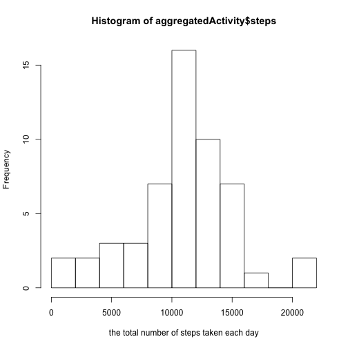

# Reproducible Research: Peer Assessment 1


## Loading and preprocessing the data
1.First, we will unzip `activity.zip` and load the corresponding csv data into a variable named `activity`.


```r
unzip("activity.zip")
activity <- read.csv("activity.csv", as.is = T)
head(activity)
```

```
##   steps       date interval
## 1    NA 2012-10-01        0
## 2    NA 2012-10-01        5
## 3    NA 2012-10-01       10
## 4    NA 2012-10-01       15
## 5    NA 2012-10-01       20
## 6    NA 2012-10-01       25
```


2.After data is loaded, the date characters are transformed to POSIXct objects. 

```r
activity$date <- as.POSIXct(activity$date)
head(activity$date)
```

```
## [1] "2012-10-01 EDT" "2012-10-01 EDT" "2012-10-01 EDT" "2012-10-01 EDT"
## [5] "2012-10-01 EDT" "2012-10-01 EDT"
```

```r
tail(activity$date)
```

```
## [1] "2012-11-30 EST" "2012-11-30 EST" "2012-11-30 EST" "2012-11-30 EST"
## [5] "2012-11-30 EST" "2012-11-30 EST"
```


## What is mean total number of steps taken per day?

Before calculation, the data frame needs to be aggregated based on date. In other words, steps for each date are added with missing values ignord.

```r
aggregatedActivity <- aggregate(steps ~ date, data = activity, FUN = sum)
head(aggregatedActivity)
```

```
##         date steps
## 1 2012-10-02   126
## 2 2012-10-03 11352
## 3 2012-10-04 12116
## 4 2012-10-05 13294
## 5 2012-10-06 15420
## 6 2012-10-07 11015
```


1.Histogram of the total number of steps taken each day...

```r
hist(aggregatedActivity$steps, breaks = 10, xlab = "the total number of steps taken each day")
```

 


2.Calculate and report the mean and median total number of steps taken per day

```r
mean <- mean(aggregatedActivity$steps)
median <- median(aggregatedActivity$steps)
mean
```

```
## [1] 10766
```

```r
median
```

```
## [1] 10765
```


## What is the average daily activity pattern?
Before calculation, the data frame needs to be aggregated based on time interval. In other words, steps for each intervel are added and averaged with missing values ignord. 


```r
aggregatedActivityMean <- aggregate(steps ~ interval, data = activity, FUN = "mean")
head(aggregatedActivityMean)
```

```
##   interval   steps
## 1        0 1.71698
## 2        5 0.33962
## 3       10 0.13208
## 4       15 0.15094
## 5       20 0.07547
## 6       25 2.09434
```


1.Time series plot...

```r
plot(aggregatedActivityMean$interval, aggregatedActivityMean$steps, type = "l", 
    xlab = "Interval", ylab = "the average number of steps taken", main = "time series plot")
```

 


2.Finding the maximum. The value shown below is the interval having the maximum averaged steps. In other words, interval ``835`` has the greatest averaged steps.


```r
index <- which.max(aggregatedActivityMean$steps)
aggregatedActivityMean$interval[index]
```

```
## [1] 835
```


## Imputing missing values
1.Calculate the total number of missing values in the dataset.

```r
length(which(is.na(activity$steps)))
```

```
## [1] 2304
```

2.I have chosen to use the mean for that 5-minute interval to replace all the na.values.

3.New data set with all the missing data filled in is called `newActivity`.

```r
newActivity <- activity
for (i in 1:length(newActivity$steps)) {
    if (is.na(newActivity[i, 1])) {
        newActivity[i, 1] <- aggregatedActivityMean[aggregatedActivityMean$interval == 
            newActivity[i, 3], 2]
    }
}
```

Double check by counting NA's in `newActivity`...

```r
length(which(is.na(newActivity$steps)))
```

```
## [1] 0
```


4.Histogram, mean and median.

Before calculation, the data frame needs to be aggregated based on date. In other words, steps for each date are added with missing values ignord.

```r
newAggregatedActivity <- aggregate(steps ~ date, data = newActivity, FUN = sum)
head(newAggregatedActivity)
```

```
##         date steps
## 1 2012-10-01 10766
## 2 2012-10-02   126
## 3 2012-10-03 11352
## 4 2012-10-04 12116
## 5 2012-10-05 13294
## 6 2012-10-06 15420
```


4a.Histogram of the total number of steps taken each day...

```r
hist(newAggregatedActivity$steps, breaks = 10, xlab = "the total number of steps taken each day w/o NA", 
    main = "Histogram w/o NA")
```

 


4b.Calculate and report the mean and median total number of steps taken per day

```r
mean <- mean(newAggregatedActivity$steps)
median <- median(newAggregatedActivity$steps)
mean
```

```
## [1] 10766
```

```r
median
```

```
## [1] 10766
```


By observation, the mean and median do not differ very much from the estimated (diff < 1). By imputting missing data, the average would be the sum over the total number which would be same for every day. So it is a more accurate estimation of the true mean and median.
## Are there differences in activity patterns between weekdays and weekends?
1.First create the factor variable...

```r
wtf <- weekdays(newActivity$date) %in% c("Sunday", "Saturday")
newActivity$weekday <- c("Weekday")
newActivity$weekday[wtf] <- c("Weekend")
newActivity$weekday <- factor(newActivity$weekday)
table(newActivity$weekday)
```

```
## 
## Weekday Weekend 
##   12960    4608
```

2.Then draw the time series plot based on Weekdays and Weekends.

```r
newActivitySplit <- split(newActivity, newActivity$weekday)
aggregatedActivityMeanWeekday <- aggregate(steps ~ interval, data = newActivitySplit$Weekday, 
    FUN = "mean")
aggregatedActivityMeanWeekday$weekday <- c("Weekday")
aggregatedActivityMeanWeekend <- aggregate(steps ~ interval, data = newActivitySplit$Weekend, 
    FUN = "mean")
aggregatedActivityMeanWeekend$weekday <- c("Weekend")
aggregatedActivityMeanNew <- rbind(aggregatedActivityMeanWeekend, aggregatedActivityMeanWeekday)
library(lattice)
xyplot(steps ~ interval | weekday, data = aggregatedActivityMeanNew, type = "l", 
    layout = c(1, 2))
```

 

Apparently, there's a difference in Weekend and Weekday behaviors. 
